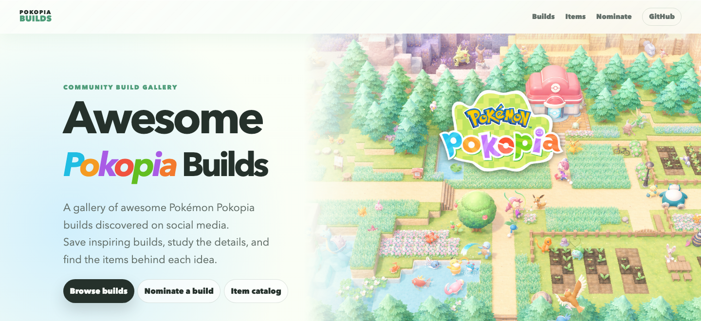

# Awesome Pokopia Builds

A community gallery of inspiring Pokémon Pokopia builds discovered on social media.

[Visit the gallery](https://tongshan4869.github.io/awesome-pokopia-builds/) ·
[Browse the item catalog](https://tongshan4869.github.io/awesome-pokopia-builds/items/) ·
[Nominate a build](https://tongshan4869.github.io/awesome-pokopia-builds/nominate/)



## Explore the gallery

Save ideas for your own island, study the details behind creative builds, and find the items that
bring each design together.

- Browse curated builds with screenshots, themes, creator credit, and links to the original posts.
- Search builds by keyword or filter them by theme.
- Use the visual item catalog to match furniture, plants, structures, and decorations by name.
- [Send us a build you love](https://tongshan4869.github.io/awesome-pokopia-builds/nominate/)
  from YouTube, TikTok, Instagram, or Reddit.

## Attribution and corrections

Every featured build links back to its original creator and source. Screenshots are used as credited
references for fan curation. If you created a featured build and want credit changed, an image
removed, or a page taken down, [open an issue](https://github.com/TongShan4869/awesome-pokopia-builds/issues)
with the source URL and requested change.

Item notes are curator-reviewed and may be imperfect. Corrections are always welcome.

## For curators and contributors

This repository stores the public Astro website and the content used to publish reviewed build
pages. It does **not** store copied full videos.

<details>
<summary><strong>Repository map</strong></summary>

- `src/content/builds/*.mdx` - reviewed build summaries shown on the website
- `public/images/builds/*/hero.png` - curated full-build screenshots
- `data/pokopia-item-catalog.json` - local catalog for item-name reference
- `data/items.json` - small fallback item database maintained by the curator
- `public/images/items/*.png` - local item figure copies used by build pages
- `curation/*.json` and `curation/*/frames/*` - ingestion drafts, frame candidates, review notes,
  and review data
- `scripts/ingest.ts` - local-only browser capture workflow for social links
- `scripts/export-build.ts` - converts reviewed curation data into public MDX
- `scripts/sync-item-catalog.ts` - refreshes the local item catalog and item figures

</details>

<details>
<summary><strong>Local development</strong></summary>

Install dependencies:

```bash
corepack pnpm install
corepack pnpm exec playwright install chromium
```

Build the site:

```bash
corepack pnpm build
```

</details>

<details>
<summary><strong>Nomination form and GitHub Pages configuration</strong></summary>

Website visitors can nominate builds through `/nominate/`. The form stores the source link,
description, and optional contact detail in Formspree. Publishing remains curator-controlled.

The nomination page defaults to:

```text
https://formspree.io/f/xjgzdogw
```

To switch forms without editing the page, set the GitHub Actions repository variable
`PUBLIC_FORMSPREE_ENDPOINT`. Local builds can use the same override:

```bash
PUBLIC_FORMSPREE_ENDPOINT="https://formspree.io/f/{form-id}" corepack pnpm build
```

The included GitHub Actions workflow builds the Astro site and publishes it to GitHub Pages.
Optionally set `PUBLIC_REPO_URL` in the Pages build environment if the homepage repository button
should point somewhere other than `https://github.com/TongShan4869/awesome-pokopia-builds`.

</details>
