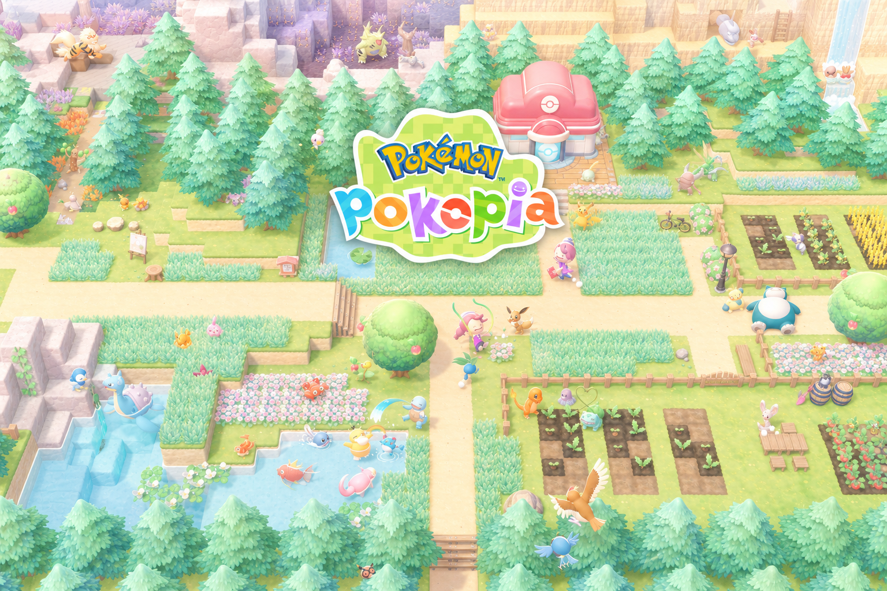

# Awesome Pokopia Builds

A community gallery of inspiring Pokémon Pokopia builds discovered on social media.

[Visit the gallery](https://tongshan4869.github.io/awesome-pokopia-builds/) ·
[Browse the item catalog](https://tongshan4869.github.io/awesome-pokopia-builds/items/) ·
[Nominate a build](https://tongshan4869.github.io/awesome-pokopia-builds/nominate/)



## Explore the gallery

Save ideas for your own island, study the details behind creative builds, and find the items that
bring each design together.

- Browse curated builds with screenshots, themes, creator credit, and links to the original posts.
- Search builds by keyword or filter them by theme.
- Use the visual item catalog to match furniture, plants, structures, and decorations by name.
- [Send us a build you love](https://tongshan4869.github.io/awesome-pokopia-builds/nominate/)
  from YouTube, TikTok, Instagram, or Reddit.

## Attribution and corrections

Every featured build links back to its original creator and source. Screenshots are used as credited
references for fan curation. If you created a featured build and want credit changed, an image
removed, or a page taken down, [open an issue](https://github.com/TongShan4869/awesome-pokopia-builds/issues)
with the source URL and requested change.

Item notes are curator-reviewed and may be imperfect. Corrections are always welcome.

## For curators and contributors

This repository stores the public Astro website and the local curation workflow used to review
build nominations. It does **not** store copied full videos.

<details>
<summary><strong>Repository map</strong></summary>

- `src/content/builds/*.mdx` - reviewed build summaries shown on the website
- `public/images/builds/*/hero.png` - curated full-build screenshots
- `data/pokopia-item-catalog.json` - local catalog for exact item-name inference
- `data/items.json` - small fallback item database maintained by the curator
- `public/images/items/*.png` - local item figure copies used by build pages
- `curation/*.json` and `curation/*/frames/*` - ingestion drafts, frame candidates, review notes,
  and AI confidence data
- `scripts/ingest.ts` - local-only browser capture workflow for social links
- `scripts/export-build.ts` - converts reviewed curation data into public MDX
- `scripts/sync-item-catalog.ts` - refreshes the local item catalog and item figures

</details>

<details>
<summary><strong>Local curation workflow</strong></summary>

Install dependencies:

```bash
corepack pnpm install
corepack pnpm exec playwright install chromium
```

Refresh the local item catalog:

```bash
POKOPIA_ITEM_CATALOG_URL="<catalog-url>" corepack pnpm sync:item-catalog
```

Capture frames from a source link:

```bash
corepack pnpm ingest "https://www.youtube.com/watch?v=V2PGF9Rfc8Q"
```

The ingest command scans the video for likely showcase moments, captures timestamped candidate
frames, scores them with local visual heuristics, auto-selects the strongest screenshot candidate,
and fills any source metadata it can find. Review the generated file in `curation/{slug}.json` and
open the selected image plus any close runners-up in `curation/{slug}/frames/`.

If YouTube headless capture returns blank or player-shell frames, capture a specific timestamp
through the Playwright browser fallback:

```bash
corepack pnpm capture-browser-frame "{slug}" --open-source --time=0 --name=opening-showcase.png
```

For faster review, timestamp-hop and capture after a short settle:

```bash
corepack pnpm capture-browser-frame "{slug}" --open-source --time=0 --name=opening-showcase.png --settle-ms=1400
corepack pnpm capture-browser-frame "{slug}" --open-source --time=416 --name=final-tour.png --settle-ms=1400 --headed
```

`capture-chrome-frame` remains as an alias for older notes. The old visible-screen crop is still
available with `--desktop --rect=x,y,width,height`, but prefer the Playwright path unless browser
capture cannot render the video.

If you already have the right screenshot, import it directly:

```bash
corepack pnpm import-screenshot "{slug}" "/absolute/path/to/screenshot.png"
```

Then export and build the site:

```bash
corepack pnpm export-build "{slug}"
corepack pnpm build
```

`export-build` refuses to publish drafts. `ingest` refuses to overwrite an existing curation file
unless you pass `--force`.

</details>

<details>
<summary><strong>Review checklist</strong></summary>

Before publishing a build:

- Reject creator intros, UI chrome, blank pages, loading shells, and transitions.
- Choose a `selectedFrame` only when the build itself is clearly visible.
- Keep explicit recommended-items or materials frames as evidence, even when they are not suitable
  hero images.
- Edit inferred items and public notes.
- Set `reviewState` to `"reviewed"` only after the visual check.

After every draft ingest, prepare a review packet with:

- A link to the selected hero frame and a request to confirm or replace it.
- Suggested public title, tags, summary, and build notes.
- A shortlist of high-confidence visible catalog items.
- A separate verification list for uncertain item matches and automated guesses to reject.
- Source URL and creator metadata.
- A prompt to approve or correct the draft.

On approval, update the draft to `reviewState: "reviewed"` and export the build.

</details>

<details>
<summary><strong>Nomination form and GitHub Pages configuration</strong></summary>

Website visitors can nominate builds through `/nominate/`. The form stores the source link,
description, and optional contact detail in Formspree. Publishing remains curator-controlled.

The nomination page defaults to:

```text
https://formspree.io/f/xjgzdogw
```

To switch forms without editing the page, set the GitHub Actions repository variable
`PUBLIC_FORMSPREE_ENDPOINT`. Local builds can use the same override:

```bash
PUBLIC_FORMSPREE_ENDPOINT="https://formspree.io/f/{form-id}" corepack pnpm build
```

The included GitHub Actions workflow builds the Astro site and publishes it to GitHub Pages.
Optionally set `PUBLIC_REPO_URL` in the Pages build environment if the homepage repository button
should point somewhere other than `https://github.com/TongShan4869/awesome-pokopia-builds`.

</details>
